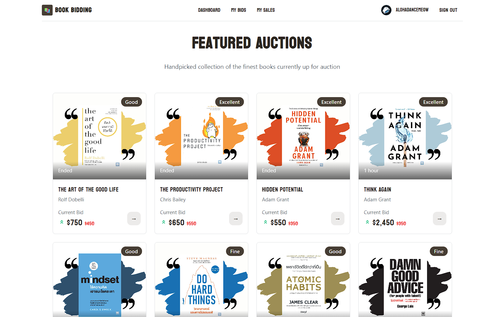

# Book Bidding (SvelteKit)

An auction platform built with SvelteKit 5. Users create book auctions, upload cover images, place bids in real time, and track sales and payments.



## Stack

- SvelteKit 5, Svelte Runes
- Better Auth + Drizzle adapter (LibSQL/Turso)
- Supabase Storage for images
- Stripe Checkout
- Flowbite Svelte UI, Tailwind v4
- Vitest for tests

## Features

- Authentication: Email/password login, optional Google/GitHub signup
- Auctions: Create/edit with image upload
- Bidding: Real-time updates via Server-Sent Events (SSE)
- My Bids: Separated Active and Ended sections
- Sales: Stats include Pending Payment Value, Expenses, and Sales Revenue
- Checkout: Stripe session creation API for won items

## Setup

```sh
npm install
npm run dev
npm run check        # type check
npm run test         # unit tests
npm run build && npm run preview
```

## Environment

Set in `.env` (private) or `.env.local`:

- `BETTER_AUTH_SECRET` — long random secret
- `BETTER_AUTH_URL` — app base URL (e.g. http://localhost:5173)
- `DATABASE_URL` — Turso/LibSQL URL
- `DATABASE_AUTH_TOKEN` — Turso auth token
- `PUBLIC_SUPABASE_URL` — Supabase project URL
- `PUBLIC_SUPABASE_PUBLISHABLE_KEY` — Supabase anon key
- `SECRET_STRIPE_KEY` — Stripe secret key
- `PUBLIC_FRONTEND_URL` — public base URL used by Stripe redirects
- Optional email: `RESEND_API_KEY`, `EMAIL_FROM`
- Optional OAuth: `GOOGLE_CLIENT_ID`, `GOOGLE_CLIENT_SECRET`, `GITHUB_CLIENT_ID`, `GITHUB_CLIENT_SECRET`

## Database

Drizzle with LibSQL/Turso.

```sh
npm run db:generate   # generate SQL
npm run db:migrate    # apply migrations
npm run db:studio     # inspect
```

Schema in `src/lib/server/db/schema.ts`.

## Auth

- Server: `src/lib/auth.ts` enables email/password. `src/hooks.server.ts` mounts Better Auth and populates `event.locals.user`/`session`.
- Client: `src/lib/auth-client.ts` provides `authClient` for login and social sign-in.
- OAuth: To enable Google/GitHub, add `socialProviders` in `src/lib/auth.ts` and set provider callback URLs (e.g. `http://localhost:5173/api/auth/callback/google` and `/github`).

## Image Upload

Supabase Storage holds images. Previews use the public URL from the stored `fileKey`.

## Realtime Bids

SSE at `routes/api/realtime/bids` streams bid events. Client store in `src/lib/stores/realtime.ts` manages connection and updates.

## Sales & Payments

- API: `routes/api/checkout/+server.ts` creates Stripe sessions.
- Stats:
  - Pending Payment Value — sum of ended auctions awaiting payment
  - Expenses — sum of your successful payments (`paid/succeeded/completed`)
  - Sales Revenue — sum of successful payments to your auctions

## Deployment

- Set `BETTER_AUTH_URL` and `PUBLIC_FRONTEND_URL` to your domain.
- Configure your SvelteKit adapter.
- Ensure all environment variables are set on the host.
